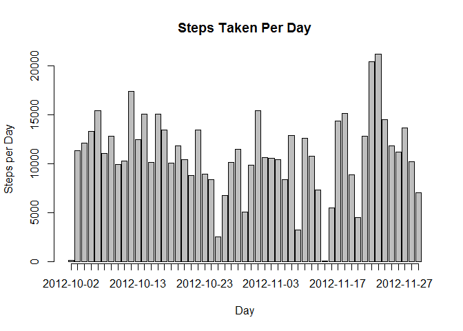
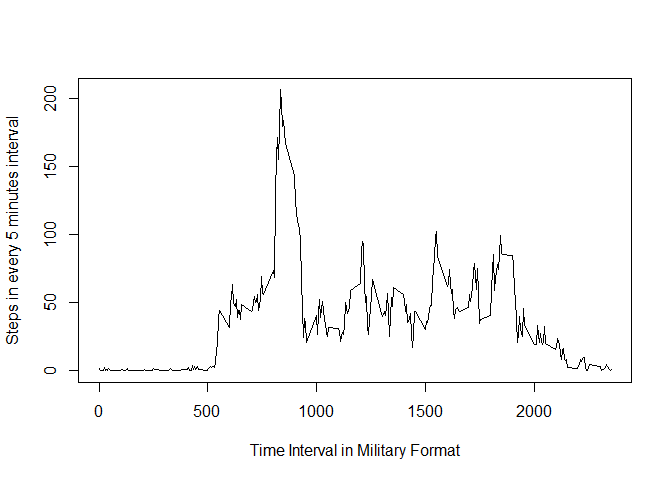
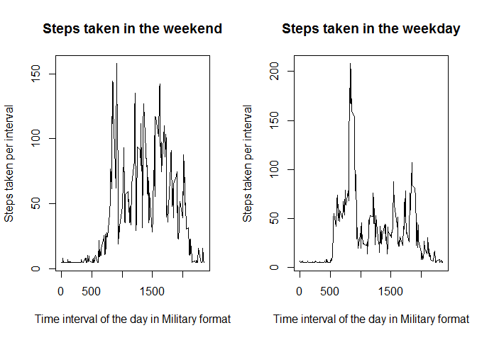

# Reproducible Research: Peer Assessment 1


## Loading and preprocessing the data

```r
dfActivity<-read.csv("activity.csv")
# remove rows with missing value
dfActivityNoNA <- na.omit(dfActivity)
```


## What is mean total number of steps taken per day?

```r
stepsByDay <- aggregate(x=dfActivityNoNA$steps, by=list(dfActivityNoNA$date), FUN=sum)

mp<- barplot(stepsByDay$x, axes=TRUE, ylab="Steps per Day", xlab="Day")
axis(1, at=mp, labels=stepsByDay$Group.1)
```

 

## Calculate and report the mean and median of the total number of steps taken per day


```r
summary(stepsByDay$x)
```

```
##    Min. 1st Qu.  Median    Mean 3rd Qu.    Max. 
##      41    8841   10760   10770   13290   21190
```

## What is the average daily activity pattern?

```r
stepsByInterval <- aggregate(x=dfActivityNoNA$steps, by=list(dfActivityNoNA$interval), FUN=mean)
plot(stepsByInterval$Group.1,stepsByInterval$x, type="l", xlab="Time Interval in Military Format",ylab="Steps in every 5 minutes interval" )
```

 


## Which 5-minute interval on average across all the days in the dataset, contains the maximum number of steps?
###From the figure above, the 5 minutes interval around 835 (8:35 AM) has the maximum number of steps taken (206)

## Imputing missing values

```r
# caculate total number of missing values in the dataset
df4NA <- dfActivity[!complete.cases(dfActivity),]
totalNARow <- nrow(df4NA)
```

### Total Number of Rows with Missing value

```r
# display the number of rows with missing value
totalNARow
```

```
## [1] 2304
```


```r
# 3. Create a new dataset that is equual to the original dataset but with the missing data filled in
# create a data frame for data impute
dfActivityImpute <- dfActivity

# there are many multiple impute methods including mi, mice amelia etc. 
# here we just use the mean step value of the whole data frame for missing value
dfActivityImpute$steps[is.na(dfActivityImpute$steps)] <- mean(dfActivityImpute$steps, na.rm=TRUE)

# 4.  calculate total number of steps each day with modified dataset
stepsByDayImpute <- aggregate(x=dfActivityImpute$steps, by=list(dfActivityImpute$date), FUN=sum)

# calculate the mean and median of total number of steps taken per day with the imputed dataset
summary(stepsByDayImpute)
```

```
##        Group.1         x        
##  2012-10-01: 1   Min.   :   41  
##  2012-10-02: 1   1st Qu.: 9819  
##  2012-10-03: 1   Median :10766  
##  2012-10-04: 1   Mean   :10766  
##  2012-10-05: 1   3rd Qu.:12811  
##  2012-10-06: 1   Max.   :21194  
##  (Other)   :55
```

```r
# here are the mean and median of total number of steps taken per day with non-modified dataset
summary(stepsByDay)
```

```
##        Group.1         x        
##  2012-10-02: 1   Min.   :   41  
##  2012-10-03: 1   1st Qu.: 8841  
##  2012-10-04: 1   Median :10765  
##  2012-10-05: 1   Mean   :10766  
##  2012-10-06: 1   3rd Qu.:13294  
##  2012-10-07: 1   Max.   :21194  
##  (Other)   :47
```


## Are there differences in activity patterns between weekdays and weekends?

```r
weekdays1 <- c("Monday", "Tuesday", "Wednesday", "Thursday", "Friday")

dfActivityImpute$wkDay <- factor((weekdays(as.Date(dfActivityImpute$date)) %in% weekdays1), levels=c(FALSE, TRUE), labels=c("weekend", "weekday"))

# create two dataset for weekend and weekday respectively
dfActivityImputWeekend <- dfActivityImpute[dfActivityImpute$wkDay=="weekend",]
dfActivityImputWeekday <- dfActivityImpute[dfActivityImpute$wkDay=="weekday",]


wkendstep <- aggregate(x=dfActivityImputWeekend$steps,by=list(dfActivityImputWeekend$interval), FUN=mean)

wkdaystep <- aggregate(x=dfActivityImputWeekday$steps,by=list(dfActivityImputWeekday$interval), FUN=mean)
par(mfrow=c(1,2))
plot(wkendstep$Group.1,wkendstep$x, type="l", xlab = "Time interval of the day in Military format", ylab="Steps taken per interval", main="Steps taken in the weekend")
plot(wkdaystep$Group.1,wkdaystep$x, type="l", xlab="Time interval of the day in Military format", ylab="Steps taken per interval", main="Steps taken in the weekday")
```

 

## Weekend and Weekday comparison
It is clear that the activities usually done in the beginning and end of the day during the weekday.
while activities performed throughout the day during the weekend.  On average the early of weekday has,
on average, the maximum steps taken
